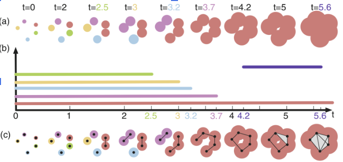

[**Report**](https://drive.google.com/file/d/1FAlMv-IWJM_IO9TYQA_W9z5kI2gjPxhd/view?usp=sharing) | [**Slides**](https://docs.google.com/presentation/d/1pnMPdV_YW2GfZZHJ3_wFsqvbd9U3P9kI/edit#slide=id.p1)

Topological data analysis to solve calssification problem of fmri diseases. You can find a brief description here: [overview](/docs/overview.pdf)

The folder [pipelines](/pipelines) contain the pipeline of classification for exracted features

The pipeline for feature extraction with the help of topological data analysis can be found here: [Pipeline_topology](/pipelines/Pipeline_topology.ipynb)